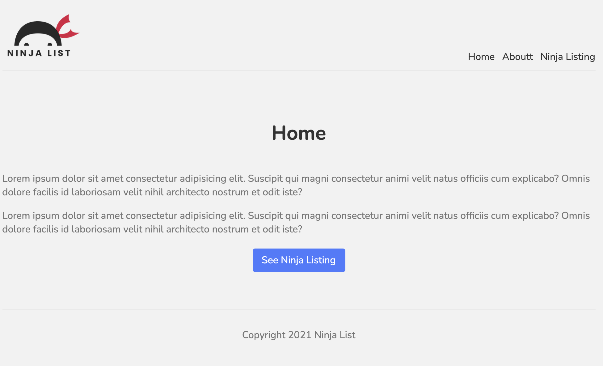

# nextjs-intro

An introductory web application to learn about Next JS.



|                                         |                                         |                                                   |
| :-------------------------------------: | :-------------------------------------: | :-----------------------------------------------: |
|      [Introduction](#nextjs-intro)      | [Table of Contents](#table-of-contents) | [Development Highlights](#development-highlights) |
|        [Deployment](#deployment)        |    [Page Directory](#page-directory)    |       [Code Hightlights](#code-highlights)        |
| [Technologies Used](#Technologies-Used) |           [Credits](#Credits)           |                [License](#License)                |

## Development Highlights

- Create Next app using npx.
- Use global styling and module styling.
- Use components and pages.
- Create default 404 page.
- Render external api calls.
- Use Layout to render components to all pages.

## Deployment

[Deployed](https://nextjs-intro-tan.vercel.app/). The web app was deployed on vercel.

## Page Directory

The components are inside the comps folder and a Layout.js is used to render repeated components.

The pages contain the api folders and other pages. The folders inside pages follows the URL link for it.

A globals.css is used in the styles folder and the corresponding css modules are created for the pages.

## Code Highlights

Fetching to external api using getStaticProps to render information.

```JavaScript
export const getStaticProps = async () => {
    const res = await fetch('https://jsonplaceholder.typicode.com/users');
    const data = await res.json();
    return {
        props: { ninjas: data }
    }
}
```

NotFound 404 default page that redirects to the home page after 3 seconds.

```JavaScript
const NotFound = () => {
    const router = useRouter();
    useEffect(() => {
        setTimeout(() => {
            router.push('/');
        }, 3000)
    }, [])
    return (
        <div className='not-found'>
            <h1>Ooops...</h1>
            <h2>That page cannot be found.</h2>
            <p>Go back to the <Link href='/'><a>Homepage</a></Link></p>
        </div>
    )
}
```

## Technologies

- [Next.js](https://nextjs.org/)

## Credits

The Next.js [tutorial](https://www.youtube.com/watch?v=A63UxsQsEbU) by The Net Ninja.

|                           |                                                                                                                                                                                                       |
| ------------------------- | ----------------------------------------------------------------------------------------------------------------------------------------------------------------------------------------------------- |
| **David Anusontarangkul** | [ LinkedIn](https://www.linkedin.com/in/anusontarangkul/) [ GitHub](https://github.com/anusontarangkul) |

## License

[](https://opensource.org/licenses/)
